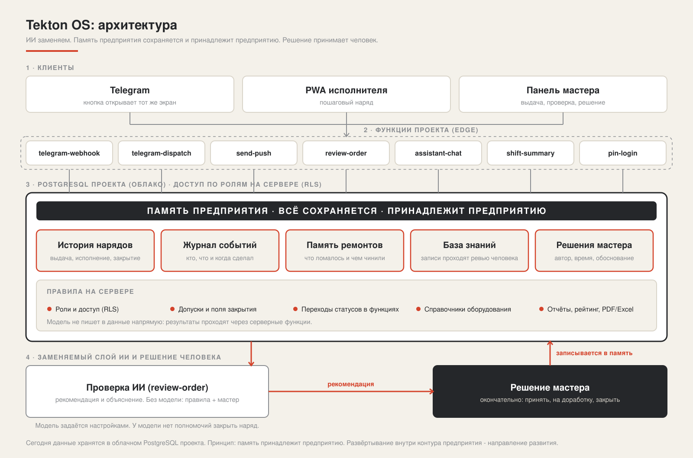

# Tekton OS

**ИИ станет товаром. Память предприятия - нет. Решение - за человеком.**

Tekton OS превращает ремонтный наряд в управляемый цикл: задание, доказательства выполнения, рекомендация ИИ и решение мастера в одной системе. Ставка простая: модели дешевеют и становятся доступны всем, а ценность остаётся у того, кто хранит историю нарядов, ремонтов и решений. Эта память принадлежит предприятию.

## Проблема

На предприятии наряд живёт в чатах, на бумаге и в памяти мастера. Исполнитель не знает, с чего начать. Мастер не видит, что реально сделано. Знания о ремонтах уходят вместе с людьми. Ответственность размыта, а качество проверяется «на глаз».

## Наше наблюдение

ИИ уже не преимущество. Завтра любая модель доступна любому за копейки, и сменить одну на другую - вопрос настройки. Дефицитом становится другое: проверенные данные о том, что ломалось, кто чинил, чем и чем закончилось. Поэтому мы строим не «умный чат», а память предприятия с заменяемым ИИ поверх неё.

Второе наблюдение: ИИ без человека на производстве не нужен никому. Он готовит рекомендацию и объясняет её. Подпись под решением ставит мастер.

## Решение

Архитектура соответствует формату кейса «НарядAI»: PWA для сотрудников, веб-панель мастера и отдельный модуль ИИ-проверки. Telegram открывает тот же рабочий экран, а не вторую систему с другой логикой.

- **Исполнитель.** Крупные карточки «В работе» и пошаговый наряд: безопасность, фото до, работа, фото после и отчёт.
- **Мастер.** Выдача наряда с оборудованием, участком, исполнителем, приоритетом и сроком. Очередь на проверку, рекомендация ИИ с объяснением, окончательное решение и журнал.
- **Руководство.** История нарядов, отчёты по периодам, рейтинг с объяснимыми факторами, анализ повторяющихся неисправностей, экспорт PDF/Excel.

## Принцип архитектуры: ИИ заменяем, память остаётся

То, что верно сегодня:

- **Данные принадлежат проекту предприятия.** Наряды, история, журнал решений и накопленные знания о ремонтах хранятся в базе проекта (PostgreSQL), а не внутри модели. Доступ ограничен ролями на сервере.
- **Модель - отдельный слой.** Модуль проверки подключается через настройки, поддерживает замену модели, а без модели работает по правилам и отправляет случай мастеру.
- **У модели нет полномочий.** Она не закрывает наряд и не меняет данные за человека. Решение мастера записывается с автором и временем.
- **Знания проходят проверку.** Записи о ремонтах попадают в память через ревью человека, а не напрямую от модели.

Сегодня система работает в облачной инфраструктуре проекта. Развёртывание внутри контура предприятия - направление развития, и разделение «память отдельно, модель отдельно» делает его возможным без переписывания продукта.

React и TypeScript отвечают за рабочие экраны. PostgreSQL и серверные функции хранят состояние, проверяют переходы и роли.

## Почему Telegram

Исполнитель не должен ставить ещё одно приложение и искать наряд в списке. Он получает сообщение там, где уже общается, нажимает кнопку и попадает на тот же рабочий экран, что и в PWA. Тот же интерфейс, те же шаги, те же правила доступа. Telegram здесь канал доставки, а не вторая система.

В нашем тесте от выдачи наряда до сообщения исполнителю проходило около 3 секунд. Это один замер, а не гарантия.

(Для контекста: в опросе «Битрикс24» сотрудников 200 белорусских компаний, 2024 год, 95% используют мессенджеры в работе, из них 85% ежедневно. Опрос провёл аналитический центр сервиса «Битрикс24». [Источник](https://www.bitrix24.by/press-release/investigations/kak-messendzhery-stali-chastyu-rabochikh-kommunikatsiy-v-belarusi.php).)

Бот: [@TektonOSdreamlabs_bot](https://t.me/TektonOSdreamlabs_bot)

## Почему сейчас

Модели научились читать фото, отчёты и историю работ, и доступ к ним дешевеет. Побеждает не тот, у кого модель мощнее, а тот, у кого накоплена проверенная память и понятное место человека в решении.

## Почему мы

Мы строим вокруг реальной смены: понятные шаги, явная ответственность, правила доступа на сервере, а не в интерфейсе. Каждое решение оставляет след, из которого растёт память предприятия.

## Результат проверки

46 из 48 (95,8%) совпадений с предварительной разметкой на контрольном наборе задач. Вторая версия настроена и проверена на тех же парах. Два исправных случая были отклонены; 41 из 48 меток не прошла проверку человеком. Это результат данного набора, не оценка точности на производстве. Методика и полные отчёты: [docs/benchmark](docs/benchmark).

## Видение

Каждый наряд на предприятии оставляет проверяемый след, а каждое решение принимает человек, у которого есть вся картина. Модели будут меняться. Память предприятия будет расти и останется его собственностью. Дальше: предсказание внеплановых нарядов по истории, единые справочники оборудования и подключение новых участков.

Blessed by &lt;O&gt;
